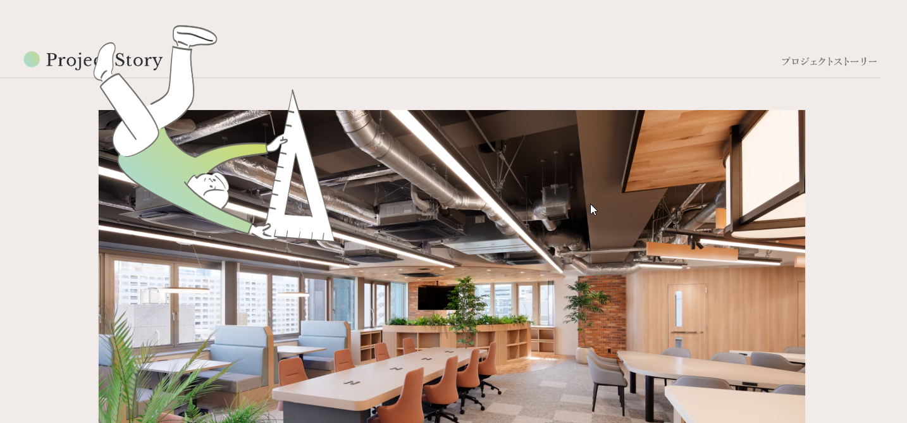
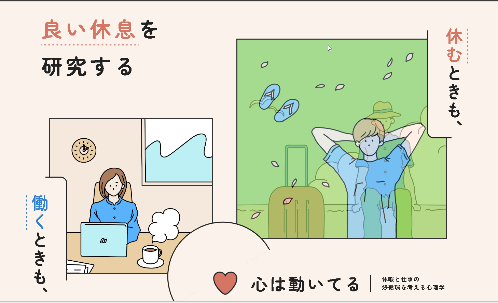

# デザインカンプ採点ルーブリック（AI採点用）

各項目10点・合計140点。**7割（98点）未満は修正ループ行き**（低い項目だけセクション修正）。
採点AIには「スクショ＋この表」を渡す。生成したAI自身には採点させない。

---

## 採点表

| # | 項目 | 10点の状態 | 0点の状態（NG例） |
|---|------|-----------|------------------|
| 1 | 配色の一貫性 | デザイントークンの色だけで構成。アクセント色は1〜2色に絞られている | トークンにない色が混入／アクセントが3色以上でうるさい |
| 2 | 余白のリズム | セクション間・要素間の余白が一定ルール（例：8の倍数）で統一 | セクションごとに余白がバラバラ／窮屈な箇所と間延びした箇所が混在 |
| 3 | 文字の階層 | 見出し・リード・本文のサイズ差がはっきりあり、視線が迷わない | 全部同じくらいのサイズ／見出しが本文に埋もれる |
| 4 | AIっぽい定番の回避 | 横3カラム均等は**ページ内1回まで**OK。他は構図に変化がある | 横3カラム均等が2回以上／全セクションが中央揃えの同じ構図 |
| 5 | 手本の骨格再現 | 手本サイトのセクション種類・順番・密度を踏襲している | 手本と無関係な汎用レイアウトになっている |
| 6 | 画像の扱い | 実写ダミー写真を使用。サイズ・角丸・トリミングが揃っている | CSS/SVGの手描きイラスト／画像の縦横比が崩れている |
| 7 | セクションの密度バランス | 詰まったセクションと抜けたセクションが交互にありメリハリがある | 全セクションが同じ密度で単調／情報が詰まりすぎ |
| 8 | CTAの目立ち | CTA（ボタン・申込帯）が配色・サイズで明確に目立つ | CTAが本文と同化／ページにCTAが無い |
| 9 | 日本語の自然さ | コピーが業種に合った自然な日本語。ダミー感が薄い | 「テキストテキスト」等の仮置き／翻訳調の不自然な文 |
| 10 | 崩れ・欠落なし | 全セクション表示される。重なり・はみ出し・空白の穴が無い | 真っ白な領域／要素の重なり事故／途中で切れている |
| 11 | 見出し位置の固定 | タイトル・見出しの位置が全セクションで固定されている（基本は左） | セクションごとに中央⇔左と位置が揺れる |
| 12 | 英日タイトルのセット | 英語タイトル＋日本語タイトルをセットで表記し、位置も揃えている | 片方だけ／セクションごとに書き方・位置がバラバラ |
| 13 | 左右余白の統一 | 左右の幅（余白）が全セクションで統一されている（意図的に明らかに広くしたセクションは除く） | セクションごとにコンテンツ幅がバラバラ |
| 14 | 雰囲気に合った小物 | サイトの雰囲気に合ったあしらい・小物（イラスト・アイコン等）が効いている | 小物ゼロで無機質／雰囲気と無関係な飾り |

※ 小物のネタ帳：ストックを常にデザイン目線で見て、他のホームページからも引き出しを増やしておく。


背景の模様、水彩画の模様は、アニメーション基本描けない。

バランスの悪いアニメーションは良くない。アニメーションは対（つい）となるといい。
左から右へ統一するとか、例えば左側の要素の場合は全部左から統一するとか。


一つのアイコンや装飾（セクションなどにかかわらず作成したワンポイんと、紙飛行機等）に対して、以下で統一させてください。そうしないと違和感を覚えてしまいます。


1. アニメーションをつけるならつける、つけないならつけない
2. 他の要素に乗せるなら乗せる、乗せないなら乗せない（統一する）


---

## 採点AIへのプロンプト（コピペ用）

```
あなたはWebデザインの審査員です。添付のカンプ全体スクショを、以下の採点表で採点してください。

【出力形式】
- 各項目：点数(0-10) ＋ 理由1行
- 合計点
- 60点台以下の項目があれば「どのセクションを・どう直すか」を具体的に1行ずつ

【採点表】
（↑の表をここに貼る）

【注意】
- 甘くしない。迷ったら低い方の点を付ける
- 「なんとなく良い」は禁止。必ず画面上の根拠を挙げる
```

---

## 減点パターン集（見つけ次第ここに追記）

- ❌ 横3カラム均等（カード3枚並べ）が**2回以上**（1回まではOK）
- ❌ 左右対称レイアウトの連続
- ❌ 全セクション中央揃え
- ❌ CSS/SVGで描いた人物・風景イラスト
- ❌ 出現アニメの opacity:0 が残って真っ黒
- ❌ アクセント色の使いすぎ（3色以上）
- ❌ 縦方向に画像を重ねるとき、まっすぐ重ねる（基本は斜めにずらす）

## 合格例（自分のストックから追記していく）

- ✅ ヨムトモ（ichizenbooks骨格）：縦書き・serifラベル・青CTA帯・10セクション踏襲

---

## PDCAの回し方（運用手順）

このルーブリックは「作って終わり」ではなく、回すたびに育てる。

### 1周の流れ

1. **P（生成）**：ツールでカンプ生成。生成プロンプトにはこの表のルールが組み込み済み（`camp.py`）
2. **D（採点）**：Claude Codeに「採点して」と言う → 全体スクショ＋この表で採点される
   - 手本スクショが無いときは項目5を採点外にして130点満点で計算
3. **C（判定）**：**7割未満 → 修正ループ行き**。低い項目だけ右クリックのセクション修正（数円）で直す
   - ページ全体の作り直しはしない（高い・数十〜100円）。低い項目だけピンポイントで
4. **A（表を育てる）**：採点が自分の感覚とズレていたら、**カンプではなく表を直す**
   - 例：「3カラム1回はアリだと思った」→ 項目4を「1回までOK」に改定（2026-07-05実施）
   - 新しいNGを見つけたら「減点パターン集」に1行追記
   - 良いカンプができたら「合格例」に1行追記

### 修正の優先順位

- 点数が低い項目から直す（1項目直すと5点前後上がる）
- 「崩れ・欠落（項目10）」は最優先（中身が出てないのは減点が大きい＋直せば確実に上がる）
- 2周直して届かなければ打ち切り（コスト上限）。手直しは自分でやるかCodex等へ

### 採点履歴（比較用に残す）

| 日付 | カンプ | 点数 | メモ |
|------|--------|------|------|
| 2026-07-05 | るぽ（就労支援B型） | 83/130 (64%) | 初回。3カラム減点・Message空・CTA帯なし |
| 2026-07-05 | るぽ（同・ルール改定後） | 88/130 (68%) | 3カラム1回OKに改定で+5。残：Message空・CTA帯 |


---

## お手本サンプル（スクショ）

英日タイトルのセット表記・見出し左固定・小物あしらいの実例：




タイトルのパターン：


【参考デザイン】

・3つの写真（縦長の写真2つ、横長の写真1つ）を、それぞれ斜めに揃えて組み合わせる。


トップ画面
・画像を時間で変えながらも、さらにタイトルタグを付けて構成するという、タップな方法もある。




・左に横文字があって、タイトルがあって、ディスクリプションがあって、右に、ワンポイント画像を縦書き。
